# ADR 0001: Initial Technology Stack

**Status:** Accepted, amended by [ADR 0002](0002-authentication-and-workspace-membership.md) (authentication), [ADR 0003](0003-tenant-isolation.md) (tenant isolation) [ADR 0004](0004-secrets-storage.md) (secrets storage) and [ADR 0005](0005-realtime-and-background-jobs-v1.md) (real-time and jobs for v1) [ADR 0006](0006-report-generation.md) (report generation) and [ADR 0007](0007-activity-log-and-trash-purge.md) (activity log and trash purge)
**Date:** 2026-08-06

## Context

The QA Automation Platform (see [PRD.md](../../PRD.md)) is a multi-tenant B2B web application built around a relationally complex domain: two-level RBAC (workspace + project roles), hierarchical folders (3 levels deep), test cases with run history, executions with a multi-state lifecycle (Draft → Ready → In Progress → Paused → Completed → Done/Canceled), bugs, tags, environments, and an immutable activity log.

Beyond CRUD, the product requires:
- Live, real-time UI updates: execution elapsed timer, step-by-step run progress, streaming console log output.
- File attachments (bug screenshots, up to 5 per bug, ≤5MB each).
- Exportable reports: self-contained HTML (with embedded images) and PDF, at multiple levels (execution, dashboards).
- A roadmap item — a Playwright-backed automated execution engine with AI-assisted step mapping — which needs long-running, pausable/resumable/cancelable background compute, not just simple async jobs.
- Cross-cutting dashboards/analytics requiring joins and aggregation across the whole entity graph.

These characteristics (heavy relational integrity, cascading deletes, join-heavy reporting, and a workflow-shaped execution lifecycle) drove the evaluation more than any single feature in isolation.

## Decision

We will build on the following stack (**Combo A** from the initial architecture discussion):

| Layer | Choice |
|---|---|
| Frontend | Next.js (React, App Router) |
| Backend / API | NestJS (Node/TypeScript) |
| Primary Database | PostgreSQL (managed — Neon or RDS); tenant isolation per ADR 0003 |
| ORM | Prisma |
| Authentication | Clerk, identity only (see ADR 0002) |
| Real-time | ~~WebSockets (Socket.IO via NestJS gateway)~~ Server-sent events for v1 (see ADR 0005) |
| File / Object Storage | AWS S3 or Cloudflare R2 |
| Background Jobs | ~~BullMQ (Redis-backed)~~ Postgres-backed queue for v1 (see ADR 0005); Temporal to be introduced later, scoped specifically to the automated execution engine once that roadmap item is rebuilt |
| Hosting | Vercel (frontend) + Railway or Render (API, worker), pending; ~~Postgres, Redis~~ no Redis in v1 (see ADR 0005), Postgres host pending (Neon or RDS) |

## Architecture Diagram

*Redrawn on 2026-09-23 to reflect ADRs 0002 to 0007. The original diagram, with Socket.IO, Redis, BullMQ and Clerk Organizations, is in this file's git history (commit `a7f2f7d`).*

```mermaid
flowchart TB
    Browser["Browser<br/>Next.js UI"]

    subgraph Vercel["Vercel"]
        NextApp["Next.js App<br/>(React, App Router)"]
    end

    subgraph Compute["Compute host (Railway or Render, pending)"]
        API["NestJS API<br/>REST + SSE streams"]
        Worker["Worker process<br/>Postgres queue: emails, reports,<br/>health snapshot, trash purge"]
        PWWorker["Playwright Automation Worker<br/>(roadmap - automated execution engine)"]
    end

    subgraph Data["Data Layer"]
        PG[("PostgreSQL (Neon or RDS, pending)<br/>shared schema + RLS<br/>job queue, LISTEN/NOTIFY")]
    end

    subgraph External["External Services"]
        Clerk["Clerk<br/>identity only"]
        Storage["S3 / R2<br/>private bucket"]
        Email["Transactional email<br/>(provider pending)"]
        KMS["Cloud KMS<br/>(later, see ADR 0004 trigger)"]
    end

    Browser -->|HTTPS| NextApp
    NextApp -->|REST + SSE| API
    NextApp -->|sign-in, sessions| Clerk
    API -->|verify session| Clerk
    API -->|tenant-scoped queries, enqueue jobs| PG
    API -->|presigned URLs| Storage
    API -.->|unwrap master key, later| KMS

    Worker -->|dequeue, tenant-scoped read/write| PG
    Worker -->|reports, image cleanup| Storage
    Worker -->|invitation emails| Email

    PWWorker -.->|run results| PG
    PWWorker -.->|screenshots| Storage
```

**Notes:**
- Solid arrows are part of v1. Dotted arrows mark the roadmap automated-execution engine (disabled per PRD §9) and the later move of the master key to a cloud KMS.
- PostgreSQL carries the data, the job queue and the fan-out of real-time notifications (`LISTEN/NOTIFY`). There is no Redis in v1 ([ADR 0005](0005-realtime-and-background-jobs-v1.md)); Redis pub/sub and the Temporal evaluation return when the automated engine is rebuilt.
- Clerk provides identity only. Workspaces, memberships, roles and invitations live in our database ([ADR 0002](0002-authentication-and-workspace-membership.md)), and RLS enforces tenant isolation ([ADR 0003](0003-tenant-isolation.md)).
- The compute host, database host and email provider are still to be decided; see [open questions](../open-questions.md).

## Rationale

- **TypeScript end-to-end** (Next.js + NestJS + Prisma) minimizes context-switching, keeps one type system from DB to UI, and lowers the hiring/onboarding bar — favored given no team-scale or budget constraints were specified pushing toward a different profile.
- **PostgreSQL** was the one layer with a clear win independent of every other choice: the domain is fundamentally relational (FK cascades on folder/test case/execution deletes, many-to-many tags, recursive folder-tree queries, join-heavy dashboards per Section 6.1/8 of the PRD). Document stores (MongoDB, Firestore) were rejected because they'd fight the domain on reporting and referential integrity.
- **NestJS** was chosen over lighter Node frameworks (Fastify/tRPC) or a Next.js-only monolith because the permission matrix (workspace role × project role, admin-only destructive actions) and the ~10-entity domain benefit from enforced structure (modules, guards, DI) rather than ad hoc conventions that would need to be self-imposed at this scale.
- **Prisma** over Drizzle/TypeORM/Kysely for DX and migration maturity; accepted trade-off is dropping to raw SQL for recursive CTEs (folder tree) where Prisma's query builder is insufficient.
- **Clerk** over a custom auth layer or Auth0: Clerk's "organization" primitive maps naturally onto the Workspace concept and ships invite flows out of the box, saving build time on sign-up/sign-in/session management. The custom two-level RBAC (workspace Owner/Collaborator × project Admin/Contributor/Viewer) and the "invite requires an existing account" rule are app-level logic layered on top regardless of provider, so this doesn't lock us out of the PRD's exact permission model. Revisit if per-user pricing becomes a concern at scale.
- **WebSockets (Socket.IO)** over SSE or polling: the PRD's real-time needs (live timer, live step progress, live console output) are naturally bidirectional-capable and map to one persistent connection per active execution view; polling was rejected outright as failing the "live" requirement.
- **BullMQ now, Temporal later (scoped)**: BullMQ covers simple async jobs (PDF/HTML report generation) with minimal operational overhead. Temporal is the better long-term fit for the automated execution engine specifically, because the execution lifecycle (pause/resume/cancel/retry with live progress) maps closely to Temporal's workflow model — but adopting it now would be premature given that engine is currently disabled/being rebuilt. This is a deliberate deferral, not a rejection.
- **S3/R2**: standard choice for bug image attachments and for embedding images into self-contained HTML reports. R2 preferred if egress cost becomes material (reports re-read images frequently); S3 preferred if the team standardizes on AWS elsewhere.
- **Vercel + Railway/Render** over a single-cloud AWS setup: prioritizes shipping speed and low operational burden over v1. The automated execution engine's Playwright workers need real long-running containers (not edge/serverless functions), which Railway/Render/Fly all support — this constraint was satisfied without requiring full AWS adoption.

## Alternatives Considered

Full comparison matrix (5 alternatives per layer, with pros/cons) and two other candidate combinations were discussed before this decision:

- **Combo B (vendor-consolidated, Supabase-leaning):** Next.js + Supabase (Postgres + Auth/RLS + Storage + Realtime) + a standalone Playwright worker on Fly.io/Render. Rejected as the primary path due to RLS policy complexity for the two-level role matrix, and deeper multi-layer vendor lock-in — but remains a viable fallback if minimizing infrastructure surface becomes the priority.
- **Combo C (built for the roadmap):** Next.js + NestJS + Postgres (RDS) + Auth0 + self-hosted WebSockets + Temporal (from day one) + AWS end-to-end. Rejected for v1 as premature investment in workflow-engine and single-cloud operational maturity before the automation engine is actually being rebuilt; revisit if/when that roadmap item becomes active.

Per-layer alternatives not chosen included: Vite+React/Remix/SvelteKit/Vue-Nuxt (frontend); Fastify+tRPC, Next.js-only monolith, FastAPI, Go (backend); MySQL/PlanetScale, MongoDB, Firestore (database); Drizzle, TypeORM, Kysely (ORM); Auth0, Supabase Auth, custom auth (authentication); Pusher/Ably, Supabase Realtime, SSE, polling (real-time); Vercel Blob, Supabase Storage, GCS (storage); SQS+Lambda/ECS, Celery, cron+DB polling (background jobs); AWS ECS/Fargate, Fly.io, self-managed Kubernetes (hosting).

## Consequences

- The team commits to a Node/TypeScript-only stack; any future Python-based AI/ML tooling (e.g. for the "Test case generation from sources" or AI confidence scoring roadmap items) will need to run as a separate service called over an API/queue boundary rather than in-process.
- Real-time and background-job infrastructure (Redis for both Socket.IO scaling and BullMQ) becomes a required piece of infra from early on, even before the automation engine is rebuilt.
- Revisit this ADR (or file a superseding one) when the automated execution engine work begins in earnest — that is the trigger point for evaluating Temporal adoption and re-checking whether Railway/Render still satisfies the compute needs of Playwright-based workers at expected concurrency.
- Clerk introduces a per-user cost and an external dependency on the authentication critical path; acceptable at current stage, flagged for re-evaluation if pricing or control requirements change.

## Amendments

- **2026-09-23, [ADR 0002](0002-authentication-and-workspace-membership.md):** Clerk is used for identity only (sign-up, sign-in, password reset, email verification, sessions). Clerk Organizations are **not** used; workspaces, memberships, roles and invitations live in our Postgres. This supersedes the Rationale bullet above that mapped Clerk organizations onto Workspaces and relied on Clerk's built-in invite flows, and it adds a transactional email service as a required component.
- **2026-09-23, [ADR 0003](0003-tenant-isolation.md):** tenant isolation uses a shared schema with `workspace_id` on every tenant table, enforced by application scoping plus Postgres Row-Level Security.
- **2026-09-23, [ADR 0004](0004-secrets-storage.md):** stored secrets (environment credentials, integration tokens, AI keys) use application-level envelope encryption with a per-workspace key; the master key starts in the hosting secret store and moves to a cloud KMS at a defined trigger.
- **2026-09-23, [ADR 0005](0005-realtime-and-background-jobs-v1.md):** v1 uses server-sent events and a Postgres-backed job queue, with no Redis, Socket.IO or BullMQ, because automated execution is disabled and every real-time need is one-way. This supersedes the Redis, Socket.IO and BullMQ nodes in the architecture diagram above for v1. Redis pub/sub and the Temporal evaluation return when work on the automated engine starts.
- **2026-09-23, [ADR 0006](0006-report-generation.md):** reports are generated by the worker from one allow-listed data object, with a server-side HTML template for the HTML export and a PDF library (pdfmake by default, no headless browser) for PDFs. Charts are drawn once as static SVG. Font coverage for non-Latin text is flagged as the main risk.
- **2026-09-23, [ADR 0007](0007-activity-log-and-trash-purge.md):** the activity log is append-only (enforced by database privileges plus a trigger), written in the same transaction as the change it records, and has no foreign keys, so the 30-day trash purge never cascades into it. This qualifies the Rationale's reliance on FK cascades for deletes: cascades apply to ordinary data, not to the log.
- **2026-09-23, architecture diagram:** redrawn to match ADRs 0002 to 0007 (no Redis, WebSockets, BullMQ or Clerk Organizations; SSE, the Postgres job queue, RLS, email and the later KMS added). The original is in git history at commit `a7f2f7d`.
