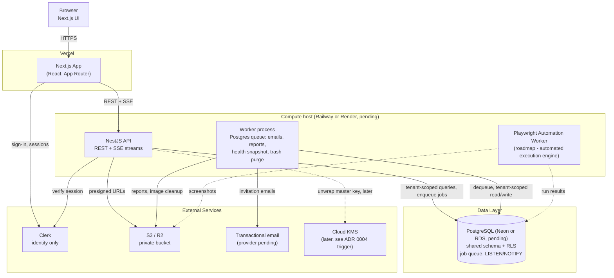

## Índice

0. [Ficha del proyecto](#0-ficha-del-proyecto)
1. [Descripción general del producto](#1-descripción-general-del-producto)
2. [Arquitectura del sistema](#2-arquitectura-del-sistema)
3. [Modelo de datos](#3-modelo-de-datos)
4. [Especificación de la API](#4-especificación-de-la-api)
5. [Historias de usuario](#5-historias-de-usuario)
6. [Tickets de trabajo](#6-tickets-de-trabajo)
7. [Pull requests](#7-pull-requests)

---

## 0. Ficha del proyecto

### **0.1. Tu nombre completo:**

Gonzalo Roland

### **0.2. Nombre del proyecto:**

Railgun — QA Automation Platform

### **0.3. Descripción breve del proyecto:**

Plataforma web colaborativa para equipos de QA que centraliza la definición, organización, ejecución y seguimiento de casos de prueba, junto con la gestión de defectos (bugs), ofreciendo dashboards de salud, analítica de tendencias y reportes exportables como fuente única de verdad del proceso de testing.

### **0.4. URL del proyecto:**

> Puede ser pública o privada, en cuyo caso deberás compartir los accesos de manera segura. Puedes enviarlos a [alvaro@lidr.co](mailto:alvaro@lidr.co) usando algún servicio como [onetimesecret](https://onetimesecret.com/).

_Pendiente de despliegue — se añadirá la URL una vez completado el primer release (ver [ADR 0001](docs/adr/0001-tech-stack.md), sección de hosting)._

### 0.5. URL o archivo comprimido del repositorio

> Puedes tenerlo alojado en público o en privado, en cuyo caso deberás compartir los accesos de manera segura. Puedes enviarlos a [alvaro@lidr.co](mailto:alvaro@lidr.co) usando algún servicio como [onetimesecret](https://onetimesecret.com/). También puedes compartir por correo un archivo zip con el contenido

_Pendiente — se añadirá la URL del repositorio una vez publicado en el hosting Git definitivo._

---

## 1. Descripción general del producto

> Describe en detalle los siguientes aspectos del producto:

### **1.1. Objetivo:**

Railgun centraliza todo el ciclo de vida de QA de un equipo de producto: definición y organización de casos de prueba, planificación y ejecución de baterías de test (manuales y, a futuro, automatizadas), seguimiento de defectos, y comunicación del estado de calidad a stakeholders no técnicos mediante dashboards y reportes exportables.

Resuelve un problema habitual en equipos de QA: la dispersión de la información de testing entre hojas de cálculo, gestores de tickets genéricos y herramientas de automatización desconectadas entre sí. Al unificar casos de prueba, ejecuciones, bugs y trazabilidad en una sola plataforma, el equipo gana una fuente única de verdad y visibilidad en tiempo real sobre la salud de calidad del producto.

Está dirigido a equipos de QA (manuales y de automatización), líderes técnicos y managers de producto que necesitan tanto ejecutar el trabajo diario de testing como reportar el estado de calidad a stakeholders.

### **1.2. Características y funcionalidades principales:**

- **Organización jerárquica de casos de prueba**: árbol de carpetas (hasta 3 niveles), etiquetas por proyecto, y casos de prueba en formato Gherkin (Given/When/Then) o descripción manual.
- **Gestión de ejecuciones de test (Test Executions)**: agrupación de casos en una ejecución con ciclo de vida propio (Draft → Ready → In Progress → Paused → Completed → Done/Canceled), entorno, navegador, viewport, locale y timezone configurables.
- **Ejecución manual y automatizada**: modo manual disponible desde el día uno; motor de ejecución automatizada basado en Playwright con mapeo de pasos asistido por IA en el roadmap (actualmente en reconstrucción).
- **Gestión de defectos (Bugs)**: severidad, estado, adjuntos de imagen (hasta 5 por bug), y vínculo directo con el test run y caso de prueba que los originó — incluyendo creación automática de bugs al fallar un run.
- **Trazabilidad completa**: grafo visual que conecta Test Cases → Executions → Test Runs → Bugs, con navegación directa entre entidades.
- **Dashboards y analítica**: KPIs de salud de proyecto (Health Score, cobertura, pass rate, bugs abiertos/críticos), tendencias configurables por rango de fechas, y reportes descargables en PDF/HTML.
- **Multi-tenant con control de acceso en dos niveles**: roles de Workspace (Owner, Collaborator) y de Proyecto (Admin, Contributor, Viewer), con reglas de acceso e invitación específicas.
- **Auditoría**: registro de actividad inmutable por proyecto, filtrable por tipo de entidad.
- **Roadmap de IA**: generación de casos de prueba desde fuentes externas, generación de código Playwright a partir de casos automatizados de alta confianza, y configuración de proveedor/modelo de IA por proyecto.

### **1.3. Diseño y experiencia de usuario:**

> Proporciona imágenes y/o videotutorial mostrando la experiencia del usuario desde que aterriza en la aplicación, pasando por todas las funcionalidades principales.

_Pendiente — se incorporarán capturas de pantalla y/o un video walkthrough de los flujos principales (alta de caso de prueba, creación y ejecución de una Test Execution, gestión de un bug, y Overview Dashboard) una vez exista una build navegable del frontend._

### **1.4. Instrucciones de instalación:**

> Documenta de manera precisa las instrucciones para instalar y poner en marcha el proyecto en local (librerías, backend, frontend, servidor, base de datos, migraciones y semillas de datos, etc.)

_El proyecto aún no ha sido scaffoldeado (ver [ADR 0001](docs/adr/0001-tech-stack.md) y sus enmiendas); las instrucciones siguientes describen el proceso previsto y se actualizarán en cuanto exista una base de código ejecutable. Las decisiones todavía abiertas se listan en [docs/open-questions.md](docs/open-questions.md)._

**Requisitos previos (previstos):**
- Node.js (LTS) y pnpm como gestor de paquetes (monorepo).
- Docker, para levantar PostgreSQL en local. **Ya no se necesita Redis en v1**: la cola de jobs y las notificaciones en tiempo real usan PostgreSQL ([ADR 0005](docs/adr/0005-realtime-and-background-jobs-v1.md)).
- Cuenta de Clerk (solo identidad: registro, inicio de sesión, verificación de email y recuperación de contraseña; [ADR 0002](docs/adr/0002-authentication-and-workspace-membership.md)).
- Credenciales de un bucket S3 o Cloudflare R2 privado para adjuntos y reportes (proveedor pendiente de decidir).
- Credenciales de un proveedor de email transaccional para invitaciones (proveedor pendiente de decidir).

**Pasos previstos:**
1. Clonar el repositorio e instalar dependencias (`pnpm install`).
2. Levantar PostgreSQL local (`docker compose up -d`). El script de inicialización crea **dos roles**: uno privilegiado para migraciones y otro, sin capacidad de saltarse RLS, para la aplicación ([ADR 0003](docs/adr/0003-tenant-isolation.md)).
3. Configurar variables de entorno (`.env`) para la API y el worker: conexión a base de datos (pool para peticiones y conexión directa para migraciones y `LISTEN/NOTIFY`), clave maestra de cifrado de secretos ([ADR 0004](docs/adr/0004-secrets-storage.md)), claves de Clerk, credenciales S3/R2 y del proveedor de email; y para el frontend, la URL de la API y la clave pública de Clerk.
4. Ejecutar las migraciones con el rol privilegiado y el script de seed con datos de ejemplo (`prisma migrate dev`, `prisma db seed`; el ORM está sujeto a validación, ver preguntas abiertas B1).
5. Levantar el backend (NestJS), el worker de jobs y el frontend (Next.js) en modo desarrollo (`pnpm dev` en cada app).

---

## 2. Arquitectura del Sistema

### **2.1. Diagrama de arquitectura:**

> Usa el formato que consideres más adecuado para representar los componentes principales de la aplicación y las tecnologías utilizadas. Explica si sigue algún patrón predefinido, justifica por qué se ha elegido esta arquitectura, y destaca los beneficios principales que aportan al proyecto y justifican su uso, así como sacrificios o déficits que implica.

La arquitectura se documenta formalmente en [ADR 0001 — Initial Technology Stack](docs/adr/0001-tech-stack.md) y en las decisiones posteriores que la enmiendan: [0002](docs/adr/0002-authentication-and-workspace-membership.md) (identidad y membresías), [0003](docs/adr/0003-tenant-isolation.md) (aislamiento por tenant), [0004](docs/adr/0004-secrets-storage.md) (secretos), [0005](docs/adr/0005-realtime-and-background-jobs-v1.md) (tiempo real y jobs en v1), [0006](docs/adr/0006-report-generation.md) (reportes) y [0007](docs/adr/0007-activity-log-and-trash-purge.md) (log de actividad y papelera). Este apartado resume el estado actual.



**Notas del diagrama:**
- Las líneas continuas forman parte de v1; las discontinuas corresponden al motor de ejecución automatizada (deshabilitado en el PRD, §9) y a la clave maestra en KMS, que se adopta cuando se cumpla el disparador del ADR 0004.
- **No hay Redis ni WebSockets en v1**: las notificaciones en tiempo real son *server-sent events* (una sola dirección, servidor → navegador) y la cola de jobs vive en PostgreSQL, con lo que un job se encola en la misma transacción que el cambio que lo origina. Redis (pub/sub) y la evaluación de Temporal vuelven cuando se retome el motor de automatización (ADR 0005).
- Clerk solo gestiona **identidad**. Workspaces, membresías, roles e invitaciones viven en nuestra base de datos (ADR 0002).
- Aún no está decidido si el navegador llama a la API directamente o a través del servidor de Next.js, ni cómo se autentican las peticiones y los streams (ver preguntas abiertas A2).

**Patrón y justificación:** el backend sigue un patrón de **monolito modular** (NestJS, organizado por dominio: workspaces, proyectos, casos de prueba, ejecuciones, bugs, actividad) con un **worker desacoplado** que consume una cola en PostgreSQL para el trabajo asíncrono (emails, reportes, jobs programados). El frontend (Next.js) es un cliente independiente que consume la API por REST y SSE.

No se optó por microservicios: dado el estado inicial del producto y el tamaño de equipo, un monolito modular maximiza la velocidad de desarrollo y preserva una única fuente de verdad transaccional — crítico dado un modelo de datos fuertemente relacional (RBAC en dos niveles, papelera con borrado lógico, dashboards con joins entre entidades). Todo el estado (datos, cola y notificaciones) reside en una sola base de datos, lo que elimina un servicio completo frente al plan original.

**Beneficios principales:** menor complejidad operativa inicial (sin Redis), consistencia transaccional entre los cambios de datos, los jobs y el log de actividad, aislamiento entre tenants reforzado por la propia base de datos, y una ruta de crecimiento clara (Redis, Temporal y KMS entran en puntos de decisión ya definidos).

**Sacrificios asumidos:**
- El monolito deberá descomponerse eventualmente si el equipo crece de forma significativa.
- Se prioriza la velocidad de entrega (Vercel + Railway/Render) sobre el control total de infraestructura de un único proveedor cloud (alternativa «Combo C» del ADR 0001).
- La cola en PostgreSQL tiene un techo de rendimiento muy superior a lo que v1 necesita, pero inferior al de un broker dedicado.
- Los reportes se generan sin navegador (biblioteca PDF), lo que exige mantener dos plantillas (HTML y PDF) y resolver la cobertura de fuentes para texto no latino (ADR 0006).
- La clave maestra de cifrado vive en el almacén de secretos de la plataforma hasta que se adopte KMS (ADR 0004).

### **2.2. Descripción de componentes principales:**

> Describe los componentes más importantes, incluyendo la tecnología utilizada

| Componente | Tecnología | Responsabilidad |
|---|---|---|
| Frontend | Next.js (React, App Router) | UI de la aplicación: árbol de carpetas, ejecuciones, bugs, dashboards, selector de workspace e invitaciones pendientes |
| API Backend | NestJS (Node/TypeScript) | Lógica de negocio, módulo único de políticas de autorización (RBAC), endpoints REST, streams SSE, capa de acceso a datos con contexto de tenant |
| Base de datos | PostgreSQL + ORM (Prisma previsto, sujeto a validación) | Persistencia relacional, esquema compartido con `workspace_id` y RLS ([ADR 0003](docs/adr/0003-tenant-isolation.md)), log de actividad de solo inserción, tablas de la cola de jobs |
| Identidad | Clerk | Registro, inicio de sesión, sesiones, recuperación de contraseña y verificación de email. **No** gestiona organizaciones ([ADR 0002](docs/adr/0002-authentication-and-workspace-membership.md)) |
| Membresías e invitaciones | Módulo propio de NestJS sobre PostgreSQL | Workspaces, roles de workspace y de proyecto, invitaciones (aceptación explícita, 7 días de vigencia), transferencia de propiedad |
| Tiempo real | Server-sent events (SSE) | Refresco de estadísticas y runs cuando otro tester actualiza una ejecución; notificación de invitaciones y de reportes listos. El temporizador de la ejecución se calcula en el navegador |
| Cola / Jobs | Cola sobre PostgreSQL (pg-boss por defecto) en un proceso worker | Emails, generación de reportes, snapshot diario del Health Score, purga de la papelera a los 30 días, limpieza de adjuntos huérfanos ([ADR 0005](docs/adr/0005-realtime-and-background-jobs-v1.md)) |
| Reportes | Plantilla HTML en servidor + biblioteca PDF (pdfmake por defecto, pendiente de spike) | Reportes HTML autocontenidos y PDF a partir de un único objeto de datos, con gráficos SVG dibujados una sola vez ([ADR 0006](docs/adr/0006-report-generation.md)) |
| Secretos | Cifrado de sobre AES-256-GCM en la aplicación | Credenciales de entorno, tokens de integración y claves de IA; clave por workspace envuelta por una clave maestra ([ADR 0004](docs/adr/0004-secrets-storage.md)) |
| Email transaccional | Proveedor pendiente de decidir | Invitaciones y recordatorios |
| Motor de automatización (roadmap) | Worker Node.js + Playwright | Ejecución automatizada de casos Gherkin. Su runtime (Temporal, Redis pub/sub) se decide cuando se retome |
| Almacenamiento de objetos | AWS S3 o Cloudflare R2 (pendiente) | Adjuntos de bugs y reportes generados, en bucket privado con URLs firmadas de vida corta |
| Hosting | Vercel (frontend) + Railway o Render (API, worker) + PostgreSQL gestionado (Neon o RDS), pendientes de decidir | Despliegue y ejecución de todos los servicios |

### **2.3. Descripción de alto nivel del proyecto y estructura de ficheros**

> Representa la estructura del proyecto y explica brevemente el propósito de las carpetas principales, así como si obedece a algún patrón o arquitectura específica.

_El repositorio aún no ha sido scaffoldeado. La estructura siguiente es la propuesta, organizada como monorepo (pnpm workspaces) para compartir tipos entre frontend y backend:_

```
railgun-qa-platform/
├── apps/
│   ├── web/              # Next.js — frontend
│   ├── api/               # NestJS — API REST + streams SSE
│   └── worker/             # Worker de jobs (cola en PostgreSQL): emails, reportes, jobs programados; a futuro, worker de automatización (Playwright)
├── packages/
│   ├── shared-types/       # Tipos/DTOs compartidos entre apps (contrato de API pendiente, ver preguntas abiertas F5)
│   ├── reporting/          # Especificaciones y dibujo SVG de gráficos, compartidos por el reporte HTML y los PDF
│   └── config/             # Configuración compartida (eslint, tsconfig)
├── prisma/
│   ├── schema.prisma        # Esquema de base de datos (ver sección 3)
│   └── seed.ts              # Datos de ejemplo para desarrollo local
├── docs/
│   ├── adr/                # Architecture Decision Records
│   └── open-questions.md   # Decisiones aún abiertas
├── PRD.md                  # Documento de producto
└── readme.md
```

Cada app dentro de `apps/` es desplegable de forma independiente. El worker comparte código de dominio con la API (mismo repositorio y mismas reglas de acceso a datos), pero se ejecuta como proceso separado para que la generación de reportes no compita con las peticiones de la API.

### **2.4. Infraestructura y despliegue**

> Detalla la infraestructura del proyecto, incluyendo un diagrama en el formato que creas conveniente, y explica el proceso de despliegue que se sigue

La infraestructura reutiliza el diagrama de la sección 2.1: **Vercel** aloja el frontend (Next.js) con despliegue automático por rama (preview deployments en cada Pull Request, producción en `main`); un proveedor de contenedores (**Railway** o **Render**, pendiente) aloja la API NestJS y el proceso worker; y **PostgreSQL** gestionado (Neon o RDS, pendiente) guarda datos, cola de jobs y notificaciones. **v1 no despliega Redis.** La región de todos los servicios está pendiente de decidir junto con los requisitos de residencia de datos.

**Proceso de despliegue previsto:**
1. Push/merge a una rama dispara el pipeline de CI (tests + build).
2. En caso de éxito, Vercel despliega el frontend automáticamente (preview en PRs, producción en `main`).
3. El proveedor de contenedores reconstruye y despliega la API y el worker a partir de la misma rama. Las migraciones se ejecutan con un **rol privilegiado propio del pipeline**; la API y el worker corren siempre con un rol sin capacidad de saltarse RLS ni de modificar el log de actividad (ADR 0003 y 0007).
4. Variables de entorno y secretos (claves de Clerk, credenciales S3/R2 y del proveedor de email, cadenas de conexión a base de datos y la clave maestra de cifrado) se gestionan en cada plataforma, nunca en el repositorio. La clave maestra no se guarda junto a las copias de seguridad de la base de datos (ADR 0004).

_La definición exacta del pipeline de CI/CD (herramienta, gates de calidad, entornos de staging) sigue pendiente, junto con la observabilidad (logs, errores, trazas y monitorización de jobs); ver [docs/open-questions.md](docs/open-questions.md), apartado F._

### **2.5. Seguridad**

> Enumera y describe las prácticas de seguridad principales que se han implementado en el proyecto, añadiendo ejemplos si procede

- **RBAC en dos niveles**: rol de Workspace (Owner, Collaborator) como techo de acceso, y rol de Proyecto (Admin, Contributor, Viewer) para el día a día. Un único módulo de políticas de NestJS evalúa ambos en cada endpoint; el Owner es Admin implícito de todos sus proyectos. Las acciones destructivas quedan restringidas a Project Admin y Workspace Owner, como especifica el PRD (sección 3).
- **Aislamiento entre tenants en dos capas** ([ADR 0003](docs/adr/0003-tenant-isolation.md)): toda tabla de tenant lleva `workspace_id` y la capa de acceso a datos filtra siempre por él; además, PostgreSQL aplica **Row-Level Security** con un rol de aplicación que no puede saltársela. Un filtro olvidado, una consulta SQL directa de un dashboard o un worker que se salte la capa devuelven cero filas en lugar de datos de otro tenant. Los jobs llevan su `workspace_id` y fallan si no lo tienen.
- **Identidad delegada en Clerk** ([ADR 0002](docs/adr/0002-authentication-and-workspace-membership.md)): contraseñas, sesiones, recuperación de contraseña y verificación de email no se implementan a mano. La API valida la sesión en cada petición y aplica después las reglas de autorización propias. Solo una cuenta con **email verificado** puede ver o aceptar invitaciones, y la pantalla de recuperación responde igual exista o no la cuenta, para no revelar quién está registrado.
- **Invitaciones seguras**: el token del enlace se guarda solo como hash, caduca a los 7 días, y nadie entra en un workspace sin aceptar explícitamente.
- **Secretos cifrados con clave por workspace** ([ADR 0004](docs/adr/0004-secrets-storage.md)): credenciales de entorno, tokens de integración y claves de IA se cifran en la aplicación (AES-256-GCM, ligados al workspace y a la fila) y en la base de datos solo existe texto cifrado. Los tokens y claves son de solo escritura; las contraseñas de entorno se pueden revelar solo a Contributors y Admins, y **cada revelación se registra en el log de actividad en la misma transacción**. Nunca aparecen en logs, reportes ni payloads de jobs (estos llevan identificadores).
- **Log de auditoría inmutable** ([ADR 0007](docs/adr/0007-activity-log-and-trash-purge.md)): el rol de la aplicación solo puede insertar y leer, y un trigger rechaza cualquier `UPDATE` o `DELETE`. Sin claves foráneas, sobrevive a la purga de la papelera.
- **Papelera con retención acotada**: lo eliminado se conserva 30 días y después se purga de forma definitiva, incluidos los archivos asociados del almacenamiento.
- **URLs firmadas y de vida corta** sobre un bucket privado para adjuntos de bugs y reportes generados, evitando URLs públicas permanentes.
- **Validación de entrada** en todos los endpoints mediante DTOs y `class-validator` en NestJS, incluyendo los límites del PRD (hasta 5 imágenes por bug, 5 MB por archivo, formatos JPEG/PNG/WebP/GIF). Como una URL prefirmada no puede imponer el número de imágenes ni el tipo, esa comprobación se hace en la aplicación.
- **Reportes seguros por construcción**: el HTML escapa todo texto de usuario, la biblioteca PDF no interpreta marcado, y ambos se construyen desde un objeto de datos con lista blanca de campos que no incluye secretos ni elementos de la papelera ([ADR 0006](docs/adr/0006-report-generation.md)).
- **HTTPS end-to-end** entre cliente, frontend y API, tanto en tráfico REST como en los streams SSE.

**Límites conocidos:** quien obtenga el entorno de la aplicación obtiene también la clave maestra (hasta adoptar KMS), un Contributor puede revelar contraseñas de entorno por diseño (por eso se auditan en lugar de impedirse), y un superusuario de la base de datos podría alterar el log de actividad.

### **2.6. Tests**

> Describe brevemente algunos de los tests realizados

_Aún no se han implementado tests, dado que el proyecto se encuentra en fase de diseño de arquitectura. Estrategia prevista:_

- **Unit tests** (Jest) sobre servicios y guards de NestJS, con foco prioritario en la lógica de RBAC (matriz de roles de workspace/proyecto), en el flujo de invitaciones (aceptar, rechazar, revocar, caducar) y en las transiciones del ciclo de vida de una Test Execution (Draft → Ready → In Progress → Paused → Completed → Done/Canceled), modelado como máquina de estados.
- **Tests de aislamiento entre tenants**: cada endpoint y cada job se ejecuta como workspace A contra datos del workspace B y se comprueba que no es visible nada; una comprobación en CI falla si una tabla con `workspace_id` no tiene política RLS (ADR 0003).
- **Tests de integridad de datos y secretos**: el log de actividad rechaza `UPDATE`/`DELETE`; el valor almacenado de un secreto es texto cifrado; revelar un secreto escribe su entrada de auditoría; la purga de la papelera respeta el plazo de 30 días y no toca el log; el objeto de datos de un reporte no contiene secretos.
- **Tests de componentes** (React Testing Library) sobre los flujos de UI más complejos: árbol de carpetas con drag-and-drop, panel de detalle de ejecución, y modales de creación (test case, execution, bug).
- **Tests end-to-end**, previsiblemente con Playwright (reutilizando la misma herramienta que impulsará el motor de automatización del producto), cubriendo los recorridos críticos: sign up → onboarding, invitación y aceptación en otro workspace, creación y ejecución de una Test Execution en modo manual, y creación de un bug desde un run fallido.

---

## 3. Modelo de Datos

### **3.1. Diagrama del modelo de datos:**

> Recomendamos usar mermaid para el modelo de datos, y utilizar todos los parámetros que permite la sintaxis para dar el máximo detalle, por ejemplo las claves primarias y foráneas.

Este modelo refleja el [PRD v1.1](PRD.md) y los ADR [0002](docs/adr/0002-authentication-and-workspace-membership.md) (identidad y membresías), [0003](docs/adr/0003-tenant-isolation.md) (aislamiento por tenant), [0004](docs/adr/0004-secrets-storage.md) (secretos), [0006](docs/adr/0006-report-generation.md) (reportes) y [0007](docs/adr/0007-activity-log-and-trash-purge.md) (log de actividad y papelera). Toda tabla de tenant lleva `workspace_id` y las de papelera llevan `deleted_by`: ambas son claves foráneas (a `WORKSPACE` y a `USER`) que **no se dibujan como líneas** para no saturar el diagrama, pero sí figuran en cada entidad. `ACTIVITY_ENTRY` no tiene relaciones a propósito: no usa claves foráneas.

```mermaid
erDiagram
    USER ||--o{ WORKSPACE_MEMBERSHIP : "has"
    WORKSPACE ||--o{ WORKSPACE_MEMBERSHIP : "has"
    WORKSPACE ||--o{ WORKSPACE_KEY : "encrypts with"
    WORKSPACE ||--o{ PROJECT : "contains"
    USER ||--o{ PROJECT_MEMBERSHIP : "has"
    PROJECT ||--o{ PROJECT_MEMBERSHIP : "has"
    PROJECT ||--o{ INVITATION : "issues"
    USER ||--o{ INVITATION : "sends"
    PROJECT ||--|| PROJECT_SETTINGS : "configured by"
    PROJECT ||--o{ FOLDER : "contains"
    FOLDER ||--o{ FOLDER : "nests"
    FOLDER ||--o{ TEST_CASE : "contains"
    PROJECT ||--o{ TAG : "defines"
    TEST_CASE ||--o{ TEST_CASE_TAG : "tagged"
    TAG ||--o{ TEST_CASE_TAG : "applied"
    BUG ||--o{ BUG_TAG : "tagged"
    TAG ||--o{ BUG_TAG : "applied"
    PROJECT ||--o{ ENVIRONMENT : "has"
    ENVIRONMENT ||--o{ ENVIRONMENT_CREDENTIAL : "has"
    PROJECT ||--o{ TEST_EXECUTION : "has"
    ENVIRONMENT |o--o{ TEST_EXECUTION : "used by"
    TEST_EXECUTION ||--o{ TEST_RUN : "contains"
    TEST_CASE |o--o{ TEST_RUN : "produces"
    TEST_RUN ||--o{ TEST_RUN_ATTEMPT : "has"
    TEST_RUN_ATTEMPT ||--o{ TEST_RUN_STEP : "has"
    PROJECT ||--o{ BUG : "tracks"
    TEST_RUN |o--o{ BUG : "surfaces"
    TEST_CASE |o--o{ BUG : "surfaces"
    BUG ||--o{ BUG_IMAGE : "has"
    PROJECT ||--o{ HEALTH_SCORE_SNAPSHOT : "records"
    PROJECT ||--o{ REPORT : "generates"
    PROJECT ||--o{ TEST_CASE : "owns"
    USER ||--o{ TEST_CASE : "creates"
    USER ||--o{ TEST_EXECUTION : "creates"
    USER |o--o{ TEST_EXECUTION : "signs off"
    USER ||--o{ BUG : "reports"
    USER ||--o{ REPORT : "requests"

    USER {
        uuid id PK
        string clerk_user_id UK
        string email UK
        string full_name
        timestamp email_verified_at "nullable, mirrored from Clerk"
        timestamp created_at
        timestamp updated_at
    }

    WORKSPACE {
        uuid id PK
        string name
        timestamp created_at
        timestamp updated_at
    }

    WORKSPACE_MEMBERSHIP {
        uuid id PK
        uuid workspace_id FK
        uuid user_id FK
        string role "Owner or Collaborator"
        timestamp created_at
    }

    WORKSPACE_KEY {
        uuid id PK
        uuid workspace_id FK
        int dek_version
        bytea wrapped_dek
        int master_key_version
        string status "Active or Retired"
        timestamp created_at
    }

    PROJECT {
        uuid id PK
        uuid workspace_id FK
        string name
        string slug "unique per workspace, immutable"
        uuid deleted_by FK "nullable"
        timestamp deleted_at "nullable, trash"
        uuid deletion_id "nullable, groups a deleted subtree"
        timestamp created_at
        timestamp updated_at
    }

    PROJECT_MEMBERSHIP {
        uuid id PK
        uuid workspace_id FK
        uuid project_id FK
        uuid user_id FK
        string role "Admin, Contributor or Viewer"
        timestamp created_at
    }

    INVITATION {
        uuid id PK
        uuid workspace_id FK
        uuid project_id FK
        uuid invited_by FK
        string email
        string role "Admin, Contributor or Viewer"
        string token_hash UK
        string status "Pending, Accepted, Declined or Revoked"
        uuid accepted_by FK "nullable"
        timestamp expires_at "7 days after last send"
        timestamp last_sent_at
        timestamp decided_at "nullable"
        timestamp created_at
    }

    PROJECT_SETTINGS {
        uuid project_id PK, FK
        uuid workspace_id FK
        boolean headless_default
        int execution_timeout_ms "nullable, roadmap"
        string screenshot_policy "nullable, roadmap"
        text context_for_ai "nullable, roadmap"
        string jira_url "nullable, roadmap"
        bytea jira_token_ciphertext "nullable, roadmap"
        string repo_url "nullable, roadmap"
        bytea repo_token_ciphertext "nullable, roadmap"
        string ai_provider "nullable, roadmap"
        string ai_model "nullable, roadmap"
        bytea ai_api_key_ciphertext "nullable, roadmap"
        int dek_version "nullable"
        timestamp updated_at
    }

    FOLDER {
        uuid id PK
        uuid workspace_id FK
        uuid project_id FK
        uuid parent_folder_id FK "nullable, self-reference, max depth 3"
        string name
        string position_key "fractional index"
        uuid deleted_by FK "nullable"
        timestamp deleted_at "nullable, trash"
        uuid deletion_id "nullable"
        timestamp created_at
        timestamp updated_at
    }

    TAG {
        uuid id PK
        uuid workspace_id FK
        uuid project_id FK
        string name
        string color
        timestamp created_at
    }

    TEST_CASE {
        uuid id PK
        uuid workspace_id FK
        uuid project_id FK
        uuid folder_id FK
        string name
        string source_type "Gherkin or Manual"
        string status "Draft, Ready or Deprecated"
        text gherkin_script "nullable"
        timestamp script_updated_at "drives Trend Reset"
        string position_key "fractional index"
        uuid created_by FK
        uuid deleted_by FK "nullable"
        timestamp deleted_at "nullable, trash"
        uuid deletion_id "nullable"
        timestamp created_at
        timestamp updated_at
    }

    TEST_CASE_TAG {
        uuid workspace_id FK
        uuid test_case_id PK, FK
        uuid tag_id PK, FK
    }

    ENVIRONMENT {
        uuid id PK
        uuid workspace_id FK
        uuid project_id FK
        string name
        string base_url
        string default_browser
        timestamp created_at
        timestamp updated_at
    }

    ENVIRONMENT_CREDENTIAL {
        uuid id PK
        uuid workspace_id FK
        uuid environment_id FK
        string alias
        string email
        bytea password_ciphertext "AES-256-GCM"
        int dek_version "key used to encrypt"
        timestamp created_at
        timestamp updated_at
    }

    TEST_EXECUTION {
        uuid id PK
        uuid workspace_id FK
        uuid project_id FK
        uuid environment_id FK "nullable, set null on delete"
        string environment_name_snapshot "nullable"
        string name
        text description "nullable"
        string status "Draft, Ready, InProgress, Paused, Completed, Done or Canceled"
        string run_mode "nullable, Manual or Automated, set at Run All"
        string browser "Chromium, Firefox or WebKit"
        int viewport_width
        int viewport_height
        string locale
        string timezone
        string app_version "nullable"
        boolean auto_create_bug_on_failure
        uuid created_by FK
        uuid signed_off_by FK "nullable"
        int elapsed_ms_accumulated "time before the last resume"
        timestamp last_resumed_at "nullable, timer runs while set"
        timestamp started_at "nullable"
        timestamp completed_at "nullable"
        timestamp signed_off_at "nullable"
        uuid deleted_by FK "nullable"
        timestamp deleted_at "nullable, trash"
        uuid deletion_id "nullable"
        timestamp created_at
        timestamp updated_at
    }

    TEST_RUN {
        uuid id PK
        uuid workspace_id FK
        uuid execution_id FK
        uuid test_case_id FK "nullable, set null on purge"
        string test_case_name_snapshot "nullable until execution starts"
        text gherkin_snapshot "nullable until execution starts"
        string position_key "fractional index"
        string status "Pass, Fail, NeedsReview or Pending"
        decimal ai_confidence "nullable"
        int duration_ms "nullable"
        timestamp created_at
        timestamp updated_at
    }

    TEST_RUN_ATTEMPT {
        uuid id PK
        uuid workspace_id FK
        uuid test_run_id FK
        int attempt_number
        string status
        timestamp started_at
        timestamp completed_at "nullable"
    }

    TEST_RUN_STEP {
        uuid id PK
        uuid workspace_id FK
        uuid test_run_attempt_id FK
        int position
        text step_text
        string outcome
        int duration_ms "nullable"
        text error_message "nullable"
    }

    BUG {
        uuid id PK
        uuid workspace_id FK
        uuid project_id FK
        uuid test_run_id FK "nullable, set null on purge"
        uuid test_case_id FK "nullable, set null on purge"
        string test_case_name_snapshot "nullable"
        uuid reporter_id FK
        string title
        string severity "Critical, High, Medium or Low"
        string status "Open, InProgress, Resolved, Closed or WontFix"
        text description "nullable"
        text steps_to_reproduce "nullable"
        text gherkin_snapshot "nullable"
        string failed_step_snapshot "nullable"
        uuid deleted_by FK "nullable"
        timestamp deleted_at "nullable, trash"
        uuid deletion_id "nullable"
        timestamp created_at
        timestamp updated_at
    }

    BUG_TAG {
        uuid workspace_id FK
        uuid bug_id PK, FK
        uuid tag_id PK, FK
    }

    BUG_IMAGE {
        uuid id PK
        uuid workspace_id FK
        uuid bug_id FK
        string storage_key "private bucket, signed reads"
        string content_type "JPEG, PNG, WebP or GIF"
        int size_bytes "max 5 MB"
        int position
        timestamp created_at
    }

    HEALTH_SCORE_SNAPSHOT {
        uuid id PK
        uuid workspace_id FK
        uuid project_id FK
        date snapshot_date
        int score "nullable, null means No data"
        string label "Healthy, AtRisk, Critical or NoData"
        jsonb components "pass rate, coverage, bug pressure, freshness"
        timestamp created_at
    }

    REPORT {
        uuid id PK
        uuid workspace_id FK
        uuid project_id FK
        uuid requested_by FK
        string report_type "ExecutionHtml, ExecutionPdf, OverviewPdf, TestCasesPdf, ExecutionsPdf or BugsPdf"
        jsonb parameters "execution id, time range"
        string status "Queued, Generating, Ready or Failed"
        string storage_key "nullable"
        text error_message "nullable"
        timestamp expires_at "nullable, retention open item"
        timestamp created_at
        timestamp completed_at "nullable"
    }

    ACTIVITY_ENTRY {
        uuid id PK "time-ordered"
        uuid workspace_id "no FK by design"
        uuid project_id "nullable, no FK by design"
        uuid actor_user_id "nullable, no FK by design"
        string actor_name_snapshot
        string action
        string entity_type
        uuid entity_id "no FK by design"
        string entity_name_snapshot
        string category "derived from entity type"
        jsonb details "nullable"
        timestamp created_at
    }
```



### **3.2. Descripción de entidades principales:**

> Recuerda incluir el máximo detalle de cada entidad, como el nombre y tipo de cada atributo, descripción breve si procede, claves primarias y foráneas, relaciones y tipo de relación, restricciones (unique, not null…), etc.

**Identidad y tenencia**

- **User**: cuenta individual, global (no pertenece a un tenant, por eso no lleva `workspace_id`). `email` y `clerk_user_id` únicos y no nulos. Clerk gestiona credenciales, verificación y sesiones (ADR 0002); esta tabla es un espejo con el estado de verificación. Las claves foráneas hacia `User` (autor, reporter, inviter…) no se anulan al salir de un workspace: el contenido se muestra como «Former member» cuando el usuario ya no tiene membresía.
- **Workspace**: raíz del tenant. No guarda `owner_id`: el propietario es la `WorkspaceMembership` con rol `Owner`, con un índice único parcial que impone **exactamente un Owner por workspace**, de modo que la transferencia de propiedad es una única transacción sobre dos filas y no puede quedar inconsistente.
- **WorkspaceMembership**: unión `User`–`Workspace` con rol `Owner` | `Collaborator`. Único `(workspace_id, user_id)`. Al eliminar a un Collaborator del workspace se eliminan también sus `ProjectMembership`.
- **WorkspaceKey**: clave de cifrado de datos (DEK) del workspace, almacenada **envuelta** por la clave maestra (ADR 0004). Único `(workspace_id, dek_version)`; `status` permite rotar (una `Active`, el resto `Retired` hasta re-cifrar).
- **Project**: unidad de organización del testing. `slug` único por workspace e inmutable. Borrado lógico (`deleted_at`, `deleted_by`, `deletion_id`); un proyecto en papelera solo lo restaura el Owner desde Workspace Settings.
- **ProjectMembership**: unión `User`–`Project` con rol `Admin` | `Contributor` | `Viewer`. Único `(project_id, user_id)`. El Owner es Admin implícito de todos los proyectos y no necesita fila.
- **Invitation**: invitación **a un proyecto** por email (ADR 0002). `token_hash` es el hash del token del enlace (nunca el token). `status` es `Pending`, `Accepted`, `Declined` o `Revoked`; **la expiración no se almacena como estado**: una invitación `Pending` con `expires_at` pasado se considera expirada al leerla. Reenviar actualiza `last_sent_at`, `expires_at` y el token. Aceptar es una transacción que crea `ProjectMembership` y, si falta, `WorkspaceMembership` Collaborator. Se consulta por una vía acotada al usuario (email verificado), no por el contexto de workspace (ADR 0003).
- **ProjectSettings**: relación 1—1 con `Project`. `headless_default` es lo único persistido y funcional hoy; el resto son columnas nulas reservadas para las funciones de roadmap del PRD §6.7 (integraciones, IA, timeout, screenshots). Los tokens y la clave de IA se guardan **solo como texto cifrado** y son de solo escritura (ADR 0004).

**Casos de prueba**

- **Folder**: nodo del árbol. Auto-referencia `parent_folder_id` (nulo = raíz); profundidad máxima 3, validada en la aplicación. `position_key` es un índice fraccionario (texto ordenable con collation `C`): mover una carpeta solo actualiza su propia fila. Borrado lógico; eliminar una carpeta marca todo su subárbol con el mismo `deletion_id`.
- **Tag**: etiqueta por proyecto, única por `(project_id, name)`. Se aplica a casos de prueba y a bugs mediante las tablas de unión **TestCaseTag** y **BugTag** (PK compuesta, ambas con `workspace_id`). Las ejecuciones no tienen etiquetas: el filtro por etiqueta del PRD §6.3.2 se resuelve a través de los casos de prueba que contienen.
- **TestCase**: unidad fundamental. Pertenece a un `Folder` (no nulo) y a un `Project`. `source_type` distingue Gherkin de Manual; `status` es su ciclo editorial. `script_updated_at` cambia solo al editar el script y alimenta la regla *Trend Reset* del PRD §6.2.3. `position_key` como en `Folder`. Borrado lógico. **No se puede eliminar mientras esté en una ejecución Draft, Ready, InProgress o Paused**: la comprobación se hace en la misma transacción que el borrado, bloqueando la fila del caso de prueba para que una ejecución creada en paralelo no lo incorpore a la vez.

**Entornos y ejecuciones**

- **Environment**: destino de ejecución (URL base, navegador por defecto), por proyecto. Se elimina de forma definitiva (no pasa por la papelera); las ejecuciones que lo usaban conservan `environment_name_snapshot` y `environment_id` pasa a nulo.
- **EnvironmentCredential**: uno o más juegos por `Environment`, únicos por `(environment_id, alias)`. `password_ciphertext` es AES-256-GCM cifrado en la aplicación con la DEK del workspace y ligado a `workspace_id` y a la fila (ADR 0004); `dek_version` indica la clave usada. La API nunca devuelve el valor salvo por el endpoint de *reveal*, que lo registra en el log de actividad en la misma transacción.
- **TestExecution**: lote de `TestRun` con ciclo de vida Draft → Ready → InProgress ⇄ Paused → Completed → Done / Canceled (PRD §6.3.4), modelado como máquina de estados en la capa de dominio (ADR 0005). `run_mode` se fija al pulsar Run All. **Temporizador con pausas**: `elapsed_ms_accumulated` guarda el tiempo hasta la última pausa y `last_resumed_at` (no nulo mientras corre) marca el inicio del tramo actual; el tiempo mostrado es `elapsed_ms_accumulated + (now − last_resumed_at)`. Borrado lógico.
- **TestRun**: una instancia de `TestCase` en una ejecución. Al pasar la ejecución a InProgress (y al reiniciarla) se rellenan `test_case_name_snapshot` y `gherkin_snapshot`; a partir de ahí el historial no depende de que el caso de prueba siga existiendo ni de sus ediciones posteriores. `test_case_id` es nulo tras purgar el caso de prueba. Al purgar una ejecución se eliminan sus runs, intentos y pasos.
- **TestRunAttempt / TestRunStep**: reintentos numerados de un run y resultado paso a paso (texto, resultado, duración, error). `position` de los pasos es un entero: siguen el orden del script y no se reordenan.

**Bugs**

- **Bug**: defecto con severidad y estado. `test_run_id` y `test_case_id` son nulos si el bug es manual o si el origen fue purgado; `test_case_name_snapshot`, `gherkin_snapshot` y `failed_step_snapshot` conservan el contexto. Borrado lógico; al purgarlo se eliminan sus imágenes del almacenamiento.
- **BugImage**: hasta 5 por bug (regla de aplicación), JPEG/PNG/WebP/GIF de hasta 5 MB. Guarda `storage_key` en un bucket privado con lecturas por URL firmada de vida corta, no una URL pública.

**Analítica, reportes y auditoría**

- **HealthScoreSnapshot**: una fila por proyecto y día, generada por un job programado; `score` nulo significa «No data». Único `(project_id, snapshot_date)`. Permite el gráfico de tendencia sin recalcular todo el histórico.
- **Report**: seguimiento de cada reporte generado (ADR 0006): tipo, parámetros, estado y `storage_key` del archivo final. `expires_at` gobierna la retención (valor pendiente, ver preguntas abiertas).
- **ActivityEntry**: registro **solo de inserción** (ADR 0007). Sin claves foráneas: referencia entidades por `entity_type` + `entity_id` y guarda instantáneas del nombre de la entidad y del actor, de modo que sobrevive a la purga de la papelera. `actor_user_id` nulo = acción del sistema. Se escribe en la misma transacción que el cambio que registra. Las restricciones (solo `INSERT`/`SELECT` para el rol de la aplicación y trigger contra `UPDATE`/`DELETE`) están en el ADR 0007.

**Reglas transversales**

- **Identificadores**: UUID v7 (ordenables en el tiempo) en todas las claves primarias.
- **Tenencia (ADR 0003)**: `workspace_id` en toda tabla de tenant, también en las hijas profundas (`TestRunStep`, `BugImage`…), para que la política RLS sea una única igualdad `workspace_id = current_setting('app.workspace_id')`.
- **Estados**: columnas de texto con restricción `CHECK`, no tipos `ENUM` de Postgres, para poder evolucionar los valores con migraciones simples.
- **Papelera**: columnas `deleted_at`, `deleted_by`, `deletion_id` en Project, Folder, TestCase, TestExecution y Bug. Las lecturas excluyen filas borradas por defecto; un job diario purga lo eliminado hace más de 30 días.
- **Fechas**: todas en UTC (`timestamptz`).
- **Índices destacados**: `TestRun (test_case_id, created_at desc)` para el historial y las señales de salud; `TestRun (execution_id, position_key)`; `ActivityEntry (workspace_id, project_id, created_at desc, id)` para paginación por cursor y `(workspace_id, entity_type, entity_id, created_at desc)` para los paneles de historial; `Bug (project_id, status, severity)`; `Invitation (lower(email), status)`; índices parciales `where deleted_at is null` en los listados.
- **Fuera del modelo de dominio**: las tablas de la cola de jobs (ADR 0005) viven en su propio esquema y no son de tenant.

---

## 4. Especificación de la API

> Si tu backend se comunica a través de API, describe los endpoints principales (máximo 3) en formato OpenAPI. Opcionalmente puedes añadir un ejemplo de petición y de respuesta para mayor claridad

**Convenciones comunes a los tres endpoints** (derivadas de los ADR [0002](docs/adr/0002-authentication-and-workspace-membership.md), [0003](docs/adr/0003-tenant-isolation.md) y [0007](docs/adr/0007-activity-log-and-trash-purge.md)):

- **Autenticación:** token de sesión de Clerk en `Authorization: Bearer`. El mecanismo exacto (bearer frente a cookie) está pendiente de confirmar, ver [preguntas abiertas A2](docs/open-questions.md). Toda petición sin sesión válida responde `401`.
- **Autorización:** un único módulo de políticas evalúa el rol de workspace y el de proyecto. Un rol insuficiente responde `403`.
- **Aislamiento entre tenants:** el workspace se deduce del recurso de la ruta (proyecto, ejecución…), nunca de un parámetro del cliente. Con RLS, un recurso de otro workspace es invisible, y uno en la papelera queda excluido de las lecturas; ambos responden **`404`**, no `403`, para no revelar su existencia.
- **Efectos comunes de toda escritura:** se registra una entrada en el log de actividad **en la misma transacción** y se emite un evento SSE a los suscriptores afectados.
- **Identificadores** UUID v7; `positionKey` es una clave de orden fraccionaria opaca (ver sección 3).

### 4.1. `POST /projects/{projectId}/test-cases` — Crear caso de prueba

```yaml
openapi: 3.0.3
paths:
  /projects/{projectId}/test-cases:
    post:
      summary: Crea un nuevo caso de prueba al final de una carpeta del proyecto
      tags: [TestCases]
      security:
        - bearerAuth: []
      parameters:
        - name: projectId
          in: path
          required: true
          schema: { type: string, format: uuid }
      requestBody:
        required: true
        content:
          application/json:
            schema:
              type: object
              required: [folderId, name]
              properties:
                folderId: { type: string, format: uuid }
                name: { type: string, example: "Login con credenciales válidas" }
                sourceType: { type: string, enum: [Gherkin, Manual], default: Manual }
                gherkinScript: { type: string, nullable: true }
      responses:
        "201":
          description: Caso de prueba creado en estado Draft
          content:
            application/json:
              schema:
                type: object
                properties:
                  id: { type: string, format: uuid }
                  projectId: { type: string, format: uuid }
                  folderId: { type: string, format: uuid }
                  name: { type: string }
                  status: { type: string, enum: [Draft, Ready, Deprecated] }
                  sourceType: { type: string, enum: [Gherkin, Manual] }
                  positionKey: { type: string, description: "Clave de orden fraccionaria" }
                  createdAt: { type: string, format: date-time }
        "401":
          description: Sin sesión válida
        "403":
          description: El usuario no tiene rol Contributor o superior en el proyecto (un Viewer no puede crear)
        "404":
          description: El proyecto o la carpeta no existe, está en la papelera o pertenece a otro workspace
        "422":
          description: Datos inválidos (por ejemplo nombre vacío)
components:
  securitySchemes:
    bearerAuth: { type: http, scheme: bearer, bearerFormat: JWT }
```

**Ejemplo de petición:**
```json
POST /projects/8f2b.../test-cases
{
  "folderId": "3a91-...",
  "name": "Login con credenciales válidas",
  "sourceType": "Gherkin",
  "gherkinScript": "Given the user is on the login page\nWhen they submit valid credentials\nThen they are redirected to the dashboard"
}
```

**Ejemplo de respuesta (201):**
```json
{
  "id": "c7d4-...",
  "projectId": "8f2b-...",
  "folderId": "3a91-...",
  "name": "Login con credenciales válidas",
  "status": "Draft",
  "sourceType": "Gherkin",
  "positionKey": "a0",
  "createdAt": "2026-08-06T15:20:00Z"
}
```

### 4.2. `POST /executions/{executionId}/run-all` — Iniciar ejecución (Run All)

```yaml
openapi: 3.0.3
paths:
  /executions/{executionId}/run-all:
    post:
      summary: Inicia una ejecución en estado Ready
      description: >
        En una única transacción: valida el rol, transiciona la ejecución de Ready a InProgress,
        fija el modo, toma el snapshot (nombre y script) de cada test run, arranca el temporizador,
        registra la actividad y emite un evento SSE a quienes miran la ejecución.
      tags: [Executions]
      security:
        - bearerAuth: []
      parameters:
        - name: executionId
          in: path
          required: true
          schema: { type: string, format: uuid }
      requestBody:
        required: true
        content:
          application/json:
            schema:
              type: object
              required: [mode]
              properties:
                mode:
                  type: string
                  enum: [Manual, Automated]
                  description: "Automated está temporalmente deshabilitado (motor en reconstrucción)"
      responses:
        "200":
          description: Ejecución transicionada a InProgress
          content:
            application/json:
              schema:
                type: object
                properties:
                  id: { type: string, format: uuid }
                  status: { type: string, enum: [InProgress] }
                  runMode: { type: string, enum: [Manual, Automated] }
                  startedAt: { type: string, format: date-time }
                  lastResumedAt: { type: string, format: date-time, description: "Inicio del tramo actual del temporizador" }
                  elapsedMsAccumulated: { type: integer, description: "Tiempo acumulado antes del tramo actual (0 al iniciar)" }
                  serverTime: { type: string, format: date-time, description: "Hora del servidor al responder; el cliente la usa para corregir la deriva de su reloj en el temporizador" }
        "401":
          description: Sin sesión válida
        "403":
          description: El usuario es Viewer en el proyecto
        "404":
          description: La ejecución no existe, está en la papelera o pertenece a otro workspace
        "409":
          description: La ejecución no está en estado Ready
        "422":
          description: "Modo Automated solicitado mientras el motor está deshabilitado, o la ejecución no tiene test runs"
components:
  securitySchemes:
    bearerAuth: { type: http, scheme: bearer, bearerFormat: JWT }
```

**Ejemplo de petición:**
```json
POST /executions/9c1a-.../run-all
{ "mode": "Manual" }
```

**Ejemplo de respuesta (200):**
```json
{
  "id": "9c1a-...",
  "status": "InProgress",
  "runMode": "Manual",
  "startedAt": "2026-08-06T15:25:00Z",
  "lastResumedAt": "2026-08-06T15:25:00Z",
  "elapsedMsAccumulated": 0,
  "serverTime": "2026-08-06T15:25:00Z"
}
```

### 4.3. `POST /bugs` — Crear bug (manual, opcionalmente desde un run)

```yaml
openapi: 3.0.3
paths:
  /bugs:
    post:
      summary: Crea un bug, opcionalmente pre-rellenado desde un test run fallido
      description: >
        Si se indica testRunId, el servidor deduce el caso de prueba y copia del run el nombre,
        el script Gherkin y el paso fallido; el cliente no envía esos valores. Las imágenes
        (hasta 5, JPEG/PNG/WebP/GIF, 5 MB cada una) se suben después con URLs prefirmadas.
      tags: [Bugs]
      security:
        - bearerAuth: []
      requestBody:
        required: true
        content:
          application/json:
            schema:
              type: object
              required: [projectId, title, severity]
              properties:
                projectId: { type: string, format: uuid }
                title: { type: string }
                description: { type: string, nullable: true }
                stepsToReproduce: { type: string, nullable: true }
                severity: { type: string, enum: [Critical, High, Medium, Low] }
                tagIds: { type: array, items: { type: string, format: uuid } }
                testRunId: { type: string, format: uuid, nullable: true }
      responses:
        "201":
          description: Bug creado
          content:
            application/json:
              schema:
                type: object
                properties:
                  id: { type: string, format: uuid }
                  projectId: { type: string, format: uuid }
                  title: { type: string }
                  status: { type: string, enum: [Open] }
                  severity: { type: string, enum: [Critical, High, Medium, Low] }
                  testRunId: { type: string, format: uuid, nullable: true }
                  testCaseId: { type: string, format: uuid, nullable: true }
                  reporterId: { type: string, format: uuid }
                  tagIds: { type: array, items: { type: string, format: uuid } }
                  createdAt: { type: string, format: date-time }
        "401":
          description: Sin sesión válida
        "403":
          description: El usuario no tiene rol Contributor o superior en el proyecto
        "404":
          description: El proyecto, el run o alguna etiqueta no existe, está en la papelera o pertenece a otro workspace
        "422":
          description: Datos inválidos, o el testRunId no pertenece al proyecto indicado
components:
  securitySchemes:
    bearerAuth: { type: http, scheme: bearer, bearerFormat: JWT }
```

**Ejemplo de petición:**
```json
POST /bugs
{
  "projectId": "8f2b-...",
  "title": "Login con credenciales válidas",
  "severity": "High",
  "testRunId": "7e5c-..."
}
```

**Ejemplo de respuesta (201):**
```json
{
  "id": "b0a2-...",
  "projectId": "8f2b-...",
  "title": "Login con credenciales válidas",
  "status": "Open",
  "severity": "High",
  "testRunId": "7e5c-...",
  "testCaseId": "c7d4-...",
  "reporterId": "5d13-...",
  "tagIds": [],
  "createdAt": "2026-08-06T15:30:00Z"
}
```

_Otros endpoints previstos, fuera del máximo de tres de este formato y aún sin especificar: pausar y reanudar una ejecución (`pause` y `resume`, ver Ticket 2), invitaciones (crear, reenviar, revocar, aceptar, rechazar), revelar una credencial de entorno, papelera (listar, restaurar), reportes (solicitar, descargar) y los streams SSE._

---

## 5. Historias de Usuario

> Documenta 3 de las historias de usuario principales utilizadas durante el desarrollo, teniendo en cuenta las buenas prácticas de producto al respecto.

**Historia de Usuario 1 — Crear un caso de prueba**

**Como** Contributor de un proyecto,
**quiero** crear un caso de prueba, con su nombre y opcionalmente un script Gherkin, en la carpeta que elija,
**para** empezar a documentar los escenarios que hay que validar.

*Criterios de aceptación:*
- Dado que estoy en la pantalla de Test Cases, cuando hago clic en "+" o uso el menú contextual de una carpeta, entonces se abre el modal de creación con un selector de carpeta destino.
- Dado que el modal está abierto, cuando intento guardar sin nombre o sin carpeta destino, entonces se me indica qué falta y no se crea nada.
- Dado que indico el nombre y la carpeta (y, opcionalmente, un script Gherkin), cuando guardo, entonces el caso de prueba se crea con estado `Draft` y se abre su vista de detalle, con su ruta de carpetas, su estado y su tipo (Gherkin o Manual).
- Dado que acabo de crear el caso, cuando miro el árbol de carpetas, entonces aparece al final de la carpeta elegida.
- Dado que acabo de crear el caso, cuando abro el Activity Log, entonces veo una entrada con mi nombre, la acción y el caso creado.
- Dado que soy Viewer, cuando accedo a la pantalla de Test Cases, entonces no veo el botón "+" ni la opción de crear en el menú contextual.

**Historia de Usuario 2 — Crear una ejecución**

**Como** Contributor de un proyecto,
**quiero** crear una ejecución con un subconjunto de casos de prueba y una configuración concreta,
**para** preparar una sesión de pruebas reproducible bajo un entorno, un navegador y unos ajustes determinados.

*Criterios de aceptación:*
- Dado que estoy en Test Executions, cuando hago clic en "+", o que estoy en un caso de prueba y uso su botón "Run" para crear una ejecución nueva, entonces se abre el modal de nueva ejecución (con ese caso ya seleccionado si vengo del botón "Run").
- Dado que el modal está abierto, cuando intento guardar sin nombre o sin ningún caso de prueba seleccionado, entonces se me indica qué falta y no se crea nada.
- Dado que indico el nombre (obligatorio), una descripción opcional y selecciono uno o más casos de prueba con el selector de carpetas, cuando elijo entorno, navegador (Chromium, Firefox o WebKit), viewport, locale, timezone y si quiero crear bugs automáticamente al fallar, y guardo, entonces se crea una ejecución en estado `Draft` con un `TestRun` en estado `Pending` por cada caso seleccionado.
- Dado que no elijo ningún entorno, cuando guardo, entonces la ejecución se crea igualmente, sin entorno asignado.
- Dado que hay casos de prueba eliminados (en la papelera), cuando abro el selector de casos, entonces no aparecen como seleccionables.
- Dado que acabo de crear la ejecución, cuando miro la lista de ejecuciones, entonces aparece con su estado `Draft` y su detalle abierto; y en el Activity Log hay una entrada con mi nombre y la ejecución creada.
- Dado que soy Viewer, cuando accedo a Test Executions, entonces no veo el botón "+" ni el botón "Run" de los casos de prueba.

**Historia de Usuario 3 — Navegar de un bug al caso de prueba que lo originó**

**Como** miembro de un proyecto, con cualquier rol (incluido Viewer),
**quiero** ir desde un bug hasta el caso de prueba que lo originó,
**para** entender qué escenario falló y revisar su script actual.

*Criterios de aceptación:*
- Dado que abro el detalle de un bug vinculado a un caso de prueba, cuando miro la sección "Linked test case", entonces veo el nombre del caso como un enlace.
- Dado que hago clic en ese enlace, cuando se carga la página, entonces llego al detalle de ese caso de prueba en la pantalla de Test Cases, con su ruta de carpetas y su script.
- Dado que estoy en el detalle del caso, cuando uso el botón Atrás del navegador, entonces vuelvo al detalle del bug del que venía.
- Dado que soy Viewer, cuando sigo el enlace, entonces puedo ver el caso de prueba pero no editarlo.
- Dado que el bug se reportó de forma manual, sin partir de un run, cuando abro su detalle, entonces no hay enlace a ningún caso de prueba.
- Dado que el caso de prueba vinculado fue eliminado, cuando abro el bug, entonces el vínculo aparece como "deleted" y no es navegable.

---

## 6. Tickets de Trabajo

> Documenta 3 de los tickets de trabajo principales del desarrollo, uno de backend, uno de frontend, y uno de bases de datos. Da todo el detalle requerido para desarrollar la tarea de inicio a fin teniendo en cuenta las buenas prácticas al respecto. 

Los tres tickets forman un **corte vertical del ciclo de vida de una ejecución** (ejecutarla manualmente), en el orden en que se construyen: base de datos → backend → frontend. Continúan la Historia de Usuario 2, que cubre la creación de la ejecución: parten de una ejecución ya creada y construyen el paso siguiente (iniciarla, pausarla y reanudarla). Cada ticket lleva sus propios criterios de aceptación y cita los ADR que debe respetar.

**Tickets previos referenciados, no documentados aquí:**
- **RG-0**: tabla `activity_entry` de solo inserción y función `ActivityLogger.log(tx, …)` que escribe en la misma transacción que el cambio ([ADR 0007](docs/adr/0007-activity-log-and-trash-purge.md)).
- **RG-S**: endpoint de streams SSE y su autenticación ([ADR 0005](docs/adr/0005-realtime-and-background-jobs-v1.md); pregunta abierta A2).
- **RG-E**: `GET /executions/{executionId}` y el módulo de políticas de autorización ([ADR 0002](docs/adr/0002-authentication-and-workspace-membership.md)).
- **Migración base** con las tablas `workspace`, `user`, `project`, `test_case` y `environment`, y el script local que crea los roles de base de datos (sección 1.4).

**Definición de hecho común a los tres tickets:** el código pasa revisión; los tests indicados pasan en CI; no hay secretos ni datos personales en logs; y si cambia un contrato de la API, se actualiza la sección 4 de este documento.

---

**Ticket 1 — Base de datos**

**Título:** Esquema de ejecuciones: temporizador con pausas, snapshots de runs y aislamiento por tenant (RLS)

**Historia relacionada:** Historia de Usuario 2 (crear una ejecución). Este ticket crea las tablas que esa historia necesita para guardar la ejecución y sus runs, y añade los campos que hacen posible el paso siguiente: el temporizador que no cuenta las pausas y el snapshot de cada run al iniciar.

**Contexto:** el ciclo de vida de una ejecución (Draft → Ready → InProgress ⇄ Paused → Completed → Done/Canceled, PRD §6.3.4) necesita persistir cuánto tiempo ha corrido de verdad, y el historial de un run no puede depender de que el caso de prueba original siga existiendo o no cambie ([readme sección 3](#3-modelo-de-datos)). Estas tablas son de tenant, por lo que deben nacer protegidas por RLS ([ADR 0003](docs/adr/0003-tenant-isolation.md)).

**Alcance — incluye:**
1. Tabla `test_execution` con todas las columnas de la sección 3, en particular `run_mode`, `elapsed_ms_accumulated` (entero, no nulo, por defecto 0), `last_resumed_at`, `started_at` y las columnas de papelera (`deleted_at`, `deleted_by`, `deletion_id`).
2. Tabla `test_run` con `test_case_id` anulable, `test_case_name_snapshot`, `gherkin_snapshot` y `position_key` (`text COLLATE "C"`).
3. Restricciones que hacen imposibles los estados incoherentes (ver más abajo).
4. Políticas RLS en ambas tablas, y el privilegio mínimo para el rol de la aplicación.
5. Un script de verificación que falla si alguna tabla con `workspace_id` no tiene RLS forzada y política, ejecutado en CI.
6. Datos de ejemplo para desarrollo: dos workspaces con ejecuciones en cada estado.

**Alcance — excluye:** la tabla del log de actividad (RG-0), `test_run_attempt` y `test_run_step`, y el job de purga de la papelera.

**Detalle técnico:**
- **Migración en SQL plano**, independiente del ORM (pregunta abierta B1), con su migración inversa.
- **Restricciones de `test_execution`:**
  ```sql
  CONSTRAINT status_valid CHECK (status IN ('Draft','Ready','InProgress','Paused','Completed','Done','Canceled')),
  CONSTRAINT elapsed_non_negative CHECK (elapsed_ms_accumulated >= 0),
  -- el temporizador corre solo mientras la ejecución está InProgress
  CONSTRAINT timer_only_in_progress CHECK ((status = 'InProgress') = (last_resumed_at IS NOT NULL)),
  CONSTRAINT run_mode_after_ready CHECK (status IN ('Draft','Ready') OR run_mode IS NOT NULL),
  CONSTRAINT run_mode_valid CHECK (run_mode IS NULL OR run_mode IN ('Manual','Automated'))
  ```
- **Integridad entre tenants:** `UNIQUE (id, workspace_id)` en `test_execution`, y en `test_run` la clave foránea compuesta `FOREIGN KEY (execution_id, workspace_id) REFERENCES test_execution (id, workspace_id) ON DELETE CASCADE`, de modo que un run no pueda apuntar a una ejecución de otro workspace.
- **Claves foráneas de origen:** `test_run.test_case_id … ON DELETE SET NULL` (los snapshots conservan el historial cuando se purga el caso de prueba); `test_execution.environment_id … ON DELETE SET NULL`.
- **RLS**, en ambas tablas:
  ```sql
  ALTER TABLE test_execution ENABLE ROW LEVEL SECURITY;
  ALTER TABLE test_execution FORCE ROW LEVEL SECURITY;
  CREATE POLICY tenant_isolation ON test_execution
    USING      (workspace_id = nullif(current_setting('app.workspace_id', true), '')::uuid)
    WITH CHECK (workspace_id = nullif(current_setting('app.workspace_id', true), '')::uuid);
  ```
  El `nullif(…, '')` evita el error de conversión que aparece cuando la conexión ya ha usado el ajuste en una transacción anterior. Sin contexto de tenant, la política no devuelve filas (falla cerrado).
- **Roles:** las tablas pertenecen al rol de migraciones; el rol `railgun_app` (sin `BYPASSRLS`, no propietario) recibe solo `SELECT, INSERT, UPDATE, DELETE` sobre ellas.
- **Índices:** `test_run (test_case_id, created_at DESC) WHERE test_case_id IS NOT NULL` (historial y señales de salud), `test_run (execution_id, position_key)`, `test_execution (project_id, status) WHERE deleted_at IS NULL`, y un índice por `workspace_id` en ambas.
- **Script de verificación de RLS:** consulta `pg_class` y `pg_policies` para listar tablas con columna `workspace_id` sin RLS forzada o sin política, y termina con código distinto de cero si hay alguna.

**Criterios de aceptación:**
- La migración se aplica sobre una base con la migración base y se revierte sin dejar objetos huérfanos.
- Como `railgun_app` con `app.workspace_id` = A, `SELECT` sobre `test_execution` devuelve solo filas de A; **sin** contexto devuelve cero filas; e insertar una fila con `workspace_id` de B falla.
- Se rechazan: una ejecución `InProgress` con `last_resumed_at` nulo; una `Paused` con `last_resumed_at` no nulo; `elapsed_ms_accumulated` negativo; un estado inexistente; y una ejecución `InProgress` sin `run_mode`.
- Insertar un `test_run` cuyo `workspace_id` no coincide con el de su ejecución falla.
- Al eliminar un caso de prueba, `test_run.test_case_id` pasa a nulo y los snapshots se conservan; al eliminar una ejecución, sus runs se eliminan en cascada.
- Añadir en un test una tabla con `workspace_id` y sin política hace fallar el script de verificación.

**Pruebas:** tests de integración contra un PostgreSQL real en contenedor (no un doble), con un caso por cada criterio anterior, y el script de verificación de RLS como paso de CI.

**Dependencias:** migración base; roles locales del script de la sección 1.4.

---

**Ticket 2 — Backend**

**Título:** Ciclo de vida de la ejecución: Run All, Pause y Resume como máquina de estados transaccional

**Historia relacionada:** continúa la Historia de Usuario 2 (crear una ejecución): parte de una ejecución en estado `Ready` y añade iniciarla (Run All), pausarla y reanudarla.

**Contexto:** hoy una ejecución solo se puede crear; este ticket la hace ejecutable en modo manual. Las reglas son de dominio y no dependen de la cola de jobs ([ADR 0005](docs/adr/0005-realtime-and-background-jobs-v1.md): el ciclo de vida es una máquina de estados en el dominio, persistida en la base de datos). El contrato de `run-all` ya está en la [sección 4.2](#42-post-executionsexecutionidrun-all--iniciar-ejecución-run-all).

**Alcance — incluye:** `POST /executions/{executionId}/run-all`, `POST /executions/{executionId}/pause` y `POST /executions/{executionId}/resume`.

**Alcance — excluye:** «Mark as Ready» y «Back to Draft», Cancel, la transición a Completed y Sign Off (pregunta abierta G6), el modo Automated, y la actualización del resultado de cada run.

**Detalle técnico:**
- **Función de transición pura** `transition(execution, action, actor, now)` en la capa de dominio, sin acceso a base de datos:

  | Acción | Desde | Hasta | Efecto sobre los campos |
  |---|---|---|---|
  | `run-all` | Ready | InProgress | `run_mode` = modo pedido, `started_at` = ahora, `last_resumed_at` = ahora, `elapsed_ms_accumulated` = 0 |
  | `pause` | InProgress | Paused | `elapsed_ms_accumulated` += (ahora − `last_resumed_at`) en ms; `last_resumed_at` = nulo |
  | `resume` | Paused | InProgress | `last_resumed_at` = ahora |

  Cualquier otra combinación estado/acción devuelve un error de dominio `invalid_transition`.
- **Reloj:** «ahora» es la hora de la transacción de la base de datos, nunca la del cliente. La respuesta incluye `serverTime` para que el cliente corrija la deriva de su reloj.
- **Una sola transacción por petición**, en este orden: abrir la transacción y fijar el contexto de tenant (`set_config('app.workspace_id', …, true)`, [ADR 0003](docs/adr/0003-tenant-isolation.md)); bloquear la fila de la ejecución con `SELECT … FOR UPDATE`; comprobar autorización; aplicar la transición; (solo `run-all`) tomar el snapshot; escribir la entrada de actividad con `ActivityLogger.log` (RG-0, acciones `execution.started`, `execution.paused`, `execution.resumed`); emitir el evento; confirmar.
- **Snapshot en `run-all`:** para cada `test_run` de la ejecución se copian `test_case_name_snapshot` y `gherkin_snapshot` desde su caso de prueba. Si algún caso de prueba no está disponible, se aborta con `409 test_case_unavailable`. Si la ejecución no tiene runs, `422 execution_empty` (PRD §6.3.4).
- **Evento en tiempo real:** `pg_notify('execution:{id}', {executionId, status})` **dentro** de la transacción, de modo que solo se entrega si se confirma ([ADR 0005](docs/adr/0005-realtime-and-background-jobs-v1.md)). El payload contiene solo identificadores.
- **Concurrencia:** el bloqueo de fila hace que dos `run-all` simultáneos den un `200` y un `409`.
- **Autorización** (módulo de políticas RG-E): Contributor o superior (PRD §3.2 y §6.3.4). Un Viewer recibe `403`. Un recurso de otro workspace o en la papelera responde `404` (RLS y filtro de borrado lógico).
- **Respuestas:** las tres devuelven `id`, `status`, `runMode`, `startedAt`, `lastResumedAt`, `elapsedMsAccumulated` y `serverTime`, como en la sección 4.2.

  | Código | Cuándo |
  |---|---|
  | 200 | Transición aplicada |
  | 401 | Sin sesión válida |
  | 403 | Usuario Viewer |
  | 404 | La ejecución no existe, está en la papelera o es de otro workspace |
  | 409 | `invalid_transition`, o `test_case_unavailable` |
  | 422 | Modo `Automated` (`automated_mode_unavailable`) o ejecución sin runs (`execution_empty`) |

**Criterios de aceptación:**
- Una ejecución `Ready` pasa a `InProgress` con el modo, `started_at`, `last_resumed_at` y `elapsed_ms_accumulated` = 0 esperados, y cada run tiene su snapshot.
- Tras `run-all`, esperar, `pause`, esperar, `resume` y `pause`, `elapsed_ms_accumulated` equivale a la suma de los tramos en ejecución y **no** incluye la pausa.
- Renombrar o editar el caso de prueba después de `run-all` no cambia el snapshot del run.
- Toda combinación no permitida de estado y acción devuelve `409`.
- Dos `run-all` concurrentes sobre la misma ejecución: uno `200`, otro `409`.
- Si la escritura de la actividad falla, no cambia ni el estado ni el timer y no se emite evento; si todo va bien, existe exactamente una entrada de actividad por transición.
- Un Viewer recibe `403`; un usuario de otro workspace recibe `404`.

**Pruebas:**
- **Unitarias** sobre la función de transición: tabla exhaustiva de pares estado/acción, y aritmética del temporizador con reloj simulado y varios ciclos de pausa y reanudación.
- **De integración** contra PostgreSQL real: todos los criterios anteriores, incluidos concurrencia, atomicidad (fallo forzado tras la transición) y entrega del evento solo tras el commit.
- **De aislamiento entre tenants:** una petición con la sesión del workspace A sobre una ejecución del B devuelve `404` ([ADR 0003](docs/adr/0003-tenant-isolation.md)).

**Dependencias:** Ticket 1, RG-0, RG-E.

**Fuera de alcance, pero relacionado:** la regla «un caso de prueba no se puede eliminar mientras esté en una ejecución Draft, Ready, InProgress o Paused» (PRD §2.11) se implementa en el ticket del borrado de casos de prueba; este ticket solo garantiza que `run-all` no falle en silencio si esa regla se incumple.

---

**Ticket 3 — Frontend**

**Título:** Cabecera de la ejecución: temporizador en vivo, acciones de ciclo de vida por rol y actualización en tiempo real

**Historia relacionada:** continúa la Historia de Usuario 2: implementa, en la vista de detalle de ejecución (PRD §6.3.3), lo que el usuario ve y hace después de crearla.

**Contexto:** el backend del Ticket 2 deja la ejecución en `InProgress` y guarda el tiempo acumulado; falta que el usuario lo vea y actúe. El temporizador se calcula en el navegador a partir de datos del servidor, sin emitir un evento por segundo ([ADR 0005](docs/adr/0005-realtime-and-background-jobs-v1.md)).

**Alcance — incluye:** el componente `ExecutionHeader` (nombre, descripción, insignia de estado con temporizador), los botones Run All, Pause y Resume, el diálogo de modo de ejecución, y la suscripción a cambios.

**Alcance — excluye:** la tabla de runs, el panel lateral, la barra de estadísticas, el cajón de consola, y los botones Mark as Ready, Cancel, Sign Off y Try Again.

**Detalle técnico:**
- **Temporizador:** el hook `useElapsedTimer({ elapsedMsAccumulated, lastResumedAt, serverTime })` devuelve `elapsedMsAccumulated + (ahoraCorregido − lastResumedAt)` mientras `lastResumedAt` no sea nulo, y el valor fijo `elapsedMsAccumulated` si lo es. `ahoraCorregido` = hora del cliente + (`serverTime` − hora del cliente al recibir la respuesta), para no depender de un reloj de cliente desajustado. Refresca una vez por segundo y se detiene al desmontar.
- **Formato** `HH:MM:SS`; el elemento lleva `role="timer"` y no anuncia cada segundo a lectores de pantalla.
- **Botones según estado y rol:**

  | Estado | Contributor / Admin | Viewer |
  |---|---|---|
  | Ready | **Run All** | nada |
  | InProgress | **Pause** | nada |
  | Paused | **Resume** | nada |

  **Run All** abre un diálogo con los modos Manual y Automated; Automated aparece deshabilitado con el aviso «en reconstrucción» (PRD §6.3.4).
- **Envío:** el botón se deshabilita mientras la petición está en curso, para evitar dobles envíos.
- **Errores:** `409` → aviso «La ejecución cambió de estado» y recarga de datos; `403` → oculta los botones; `422` → mensaje en el diálogo; error de red → botón reintentar.
- **Actualización en vivo:** el hook `useExecutionStream(executionId)` usa un cliente SSE basado en `fetch` (los `EventSource` nativos no envían cabecera `Authorization`; pregunta abierta A2) y, al recibir `execution.updated` o al **reconectar**, vuelve a pedir la ejecución completa (los eventos son avisos; el estado es la fuente de verdad). Ambos hooks se envuelven en `useExecution` para poder cambiar la librería de datos cuando se decida (pregunta abierta F6).
- **Estados de carga y error** de la propia cabecera (esqueleto y mensaje con reintento).

**Criterios de aceptación:**
- Con la ejecución `InProgress`, el temporizador avanza cada segundo desde el valor acumulado; al pausar se detiene en ese valor; al reanudar continúa desde él sin contar la pausa.
- Los botones que aparecen para cada estado y rol coinciden exactamente con la tabla anterior; un Viewer no ve ninguno.
- Si otro usuario pausa la ejecución, la cabecera lo refleja sin recargar la página, y tras un corte de conexión se recupera el estado correcto al reconectar.
- Con el reloj del navegador desajustado varios minutos, el temporizador muestra igualmente el tiempo correcto.
- Una respuesta `409` muestra el aviso y deja la cabecera en el estado real; no quedan botones bloqueados.

**Pruebas:**
- **Unitarias** del hook `useElapsedTimer` con temporizadores simulados: parado, en marcha, pausa, reanudación y desajuste de reloj.
- **De componente** (React Testing Library): matriz estado × rol de la tabla de botones, deshabilitado durante el envío, y cada rama de error.
- **Del hook de streams** con un flujo simulado: evento recibido, reconexión y refetch.
- **End-to-end** (Playwright, [sección 2.6](#26-tests)): iniciar, esperar, pausar, esperar y reanudar, comprobando con tolerancia que el tiempo mostrado excluye la pausa.

**Dependencias:** Ticket 2, RG-S (endpoint de streams) y RG-E (lectura de la ejecución).

---

## 7. Pull Requests

> Documenta 3 de las Pull Requests realizadas durante la ejecución del proyecto

**Pull Request 1**

**Pull Request 2**

**Pull Request 3**

